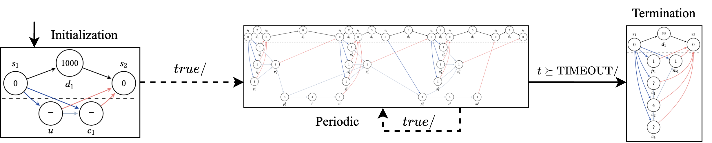
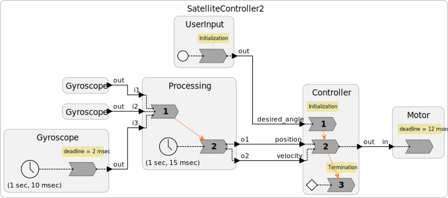

# Quasi-Static Scheduling for Deterministic Timed Concurrent Models on Multi-Core Hardware

### Research Question
Real-time embedded software aims to be predictable and efficient to run. To this end, _(quasi-)static scheduling_ has been applied extensively on a variety of concurrent models of computation, including [SDF](https://en.wikipedia.org/wiki/Synchronous_Data_Flow), [BDF](https://ptolemy.berkeley.edu/ptolemyclassic/almagest/docs/user/html/domains.doc5.html), [SADF](https://ieeexplore.ieee.org/document/6045491), and [LET](https://cs.uni-salzburg.at/~anas/papers/ARTS-chapter.pdf).
These existing techniques for generating schedules at compile time are strikingly similar across models.

In this paper, we ask the question — "Can these existing methods be _unified_ and _generalized_ for future models of computation?"

### Key Idea

The answer presented in this paper is **State Space Finite Automata (SSFA)**, an intermediate formalism bridging a model of computation and its underlying (quasi-)static schedules.

In a nutshell, an SSFA is a state machine where each state contains a DAG task set.
The SSFA should be derived from a high-level model of computation,
and we define deterministic timed concurrent models (DTCMs) to be a class of models that supports deriving SSFAs from models' semantics.

Once an SSFA is constructed, a quasi-static schedule can be produced by partitioning each DAG task set based on the number of available cores.

### Application

This repository shows how to apply the SSFA-based quasi-static scheduling technique to a synchronous subset of Lingua Franca (LF), which is an emerging programming model for cyber-physical systems.

Above shows a satellite attitude controller modelled in Lingua Franca (LF).
To perform quasi-static scheduling on this LF model, our extended LF compiler generates an SSFA (shown in the 1st figure) from the input LF model, partitions all DAGs in the SSFA, and generates executable schedules using an IR that can be interpreted by the LF runtime system.

In this artifacts repository, you will find how to:
1. Run the performance benchmark: [README](benchmarks/README.md),
2. Run the satellite attitude controller case study: [README](satellite-controller/README.md).

Please submit any issues to the issues tab, or contact Shaokai Lin at <shaokai@berkeley.edu>.

Paper link: https://dl.acm.org/doi/10.1145/3762653